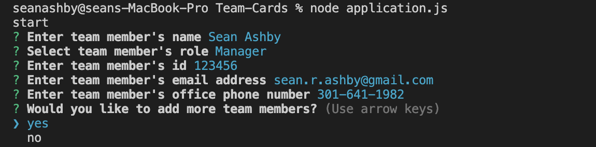
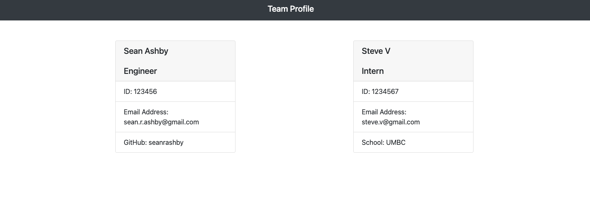

# Team-Cards
Unit 10 homework

# Project Description
The Team Cards Generator is a command-line-input application run in Node that prompts the user for information that is then displayed in the HTML file.  Before running the application the user must perform an npm install for all the required dependencies.

Launching the app results in the user being prompted for input via fs, and inquierer that populates onto HTML.  

A screenshot showing an example user input is shown below:

The user prompts allow the user to input engineers, managers, employees and interns. 

# Techniques and Technologies Used
This application was created with OOP methods in mind. The app runs Node.js, Inquirer, and FS modules to complete the command line prompts and constructors to add and display team members. 

This application uses TDD methodology with Jest to ensure that the constructors work as desired.  